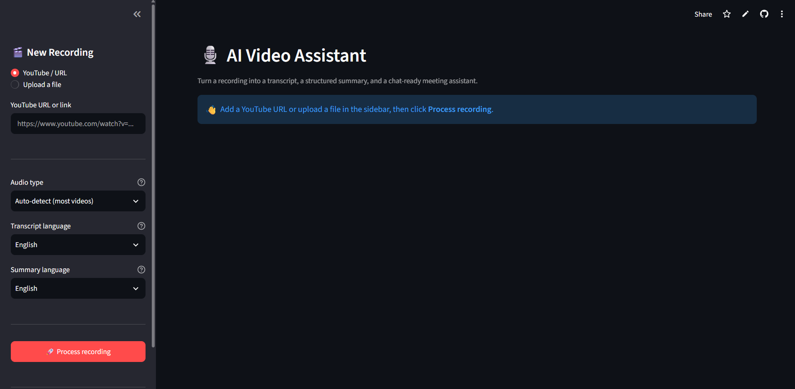

# AI Video Assistant

[](https://streamlit.io)
[](LICENSE)

Turn any YouTube video or local recording into a full transcript, a structured AI summary, a downloadable PDF report, and a chat-ready assistant you can ask follow-up questions — with first-class support for English, Arabic (full RTL rendering), and Hindi-English (Hinglish) code-switched speech.



## Features

- **Flexible input** — paste a YouTube URL or upload a local audio/video file (mp3, wav, m4a, mp4, mov, mkv)
- **Transcription** — local Whisper for general audio, or a specialized Hinglish ASR model for Hindi-English code-switched speech, with hallucination-suppression tuning and a domain-vocabulary hint
- **Translation** — rewrite the raw transcript into English or Arabic
- **AI summary & extraction** — meeting summary, action items, key decisions, and open questions, generated via an LLM (through [OpenRouter](https://openrouter.ai))
- **RAG chat** — ask follow-up questions about the recording; answers are grounded in the transcript via a LlamaIndex retriever, with a relevance threshold that avoids hallucinated answers when nothing relevant is found
- **PDF reports** — polished, professionally styled PDF export for both the summary report and the raw/translated transcript, including correct Arabic reshaping and right-to-left text layout
- **Guardrails & orchestration** — a [LangGraph](https://github.com/langchain-ai/langgraph) state machine validates input/output at each step (unsupported languages, empty transcripts, blocked/invalid requests) before routing to the right agent

## Architecture

The pipeline logic lives in a sequence of **Jupyter notebooks** (`00_...` through `11_...`), each one a self-contained module. `streamlit_app.py` loads them in order at startup — executing each notebook's code cells into one shared namespace, the script equivalent of Jupyter's `%run` — so the notebooks stay the single source of truth for the pipeline (no duplicated `.py` copies of the same logic).

| Notebook | Responsibility |
|---|---|
| `00_llm_config.ipynb` | OpenRouter LLM client, output-language instructions |
| `01_audio_processor.ipynb` | YouTube download (yt-dlp) / local file conversion, audio chunking |
| `02_transcriber.ipynb` | Whisper transcription (general + Hinglish-specialized), transcript translation |
| `03_summarizer.ipynb` | Meeting summary + title generation |
| `04_extractor.ipynb` | Action items, key decisions, open questions extraction |
| `05_vector_store.ipynb` | Chroma vector store for the transcript |
| `06_rag_engine.ipynb` | LangChain RAG chain over the Chroma store |
| `07_report_generator.ipynb` | PDF report generation (ReportLab), with Arabic RTL shaping |
| `08_llamaindex_retriever.ipynb` | LlamaIndex-based retriever used for chat, with greeting detection and a not-covered fallback |
| `09_agents.ipynb` | `content_agent` (full pipeline for a new recording) and `rag_agent` (chat) |
| `10_guardrails.ipynb` | Input/output validation for the orchestration graph |
| `11_orchestrator.ipynb` | LangGraph state machine wiring the agents and guardrails together |
| `12_edge_case_tests.ipynb` | Standalone tests for edge cases (silent audio, language mismatches, greetings, broken URLs, corrupted files) |

## Prerequisites

- Python 3.10+
- [ffmpeg](https://ffmpeg.org/download.html) installed and on your `PATH` (required by `yt-dlp` and `pydub` for audio extraction/conversion)
- An [OpenRouter](https://openrouter.ai/keys) API key

## Setup

1. **Create a virtual environment**
   ```bash
   python -m venv .venv
   source .venv/bin/activate      # Windows: .venv\Scripts\activate
   ```
   If you use conda instead, `conda create -n agent-vision python=3.11 -y && conda activate agent-vision` works the same way — the rest of these steps are identical either way (`pip` still works fine inside a conda environment). Just don't mix the two (e.g. don't `python -m venv` *inside* an already-active conda environment) — pick one.

2. **Install dependencies**
   ```bash
   pip install -r requirements.txt
   ```
   This installs the **CPU-only** build of `torch` by default. The app works fine like this — transcription just runs on your CPU. If that's all you need, skip straight to step 3.

3. **(Optional but recommended) Switch PyTorch to your GPU**, if you have an NVIDIA GPU. This makes transcription dramatically faster.

   a. Confirm you have a working NVIDIA driver:
      ```bash
      nvidia-smi
      ```
      This should print a table with your GPU's name and a `CUDA Version: X.Y` line. If the command isn't found, install the NVIDIA driver for your card first.

   b. Install the matching CUDA build of `torch` (CUDA 12.6 works with any driver reporting CUDA 12.6 or newer — driver support is backwards-compatible, so this is a safe default even if `nvidia-smi` shows a newer version like 13.x):
      ```bash
      pip install torch --index-url https://download.pytorch.org/whl/cu126 --force-reinstall
      ```
      (`--force-reinstall` matters here — without it, pip sees `torch` is "already satisfied" from step 2 and silently keeps the CPU-only build.)

   c. Verify it worked:
      ```bash
      python -c "import torch; print(torch.__version__); print('CUDA available:', torch.cuda.is_available())"
      ```
      You should see a version ending in `+cu126` and `CUDA available: True`. If it still shows `+cpu`, the install in step (b) didn't actually run in this environment — double check you're in the same activated venv/conda env you'll launch Streamlit from.

   d. **Known issue on some GPUs (especially older/laptop/lower-end cards):** Whisper defaults to fp16 (half-precision) on any CUDA device, which can produce `NaN` logits and an empty transcript on affected cards. If you hit an error mentioning `invalid values: tensor([[nan, nan, ...`, this project already works around it — `02_transcriber.ipynb` forces fp32 by default (`WHISPER_FP16_SAFE=false`). If your GPU handles fp16 fine and you want the extra speed, set `WHISPER_FP16_SAFE=true` in `.env`.

   e. Don't manually `pip install torchvision` — this project never uses it, and an incompatible/mismatched `torchvision` build is a common source of a confusing `Could not import module 'WhisperProcessor'` error (it gets pulled in by `transformers`' unrelated image-processing code, not by anything Whisper-related here). If you ever see that error, `pip uninstall torchvision -y` is usually the fix.

4. **Configure your API key**

   Copy `.env.example` to `.env` and fill in your key:
   ```bash
   cp .env.example .env
   ```
   ```env
   OPENROUTER_API_KEY=your-key-here
   ```
   Never commit a real key in `.env.example` — it's meant to be a template with a placeholder, and (unlike `.env`) it's tracked by git.

5. **Run the app** (from inside this folder, so relative paths to notebooks/fonts/downloads resolve correctly)
   ```bash
   streamlit run streamlit_app.py
   ```
   **After editing any `.ipynb` file or `streamlit_app.py`, fully restart this command (Ctrl+C, then run it again)** rather than just refreshing the browser tab. The pipeline is loaded once into a cached resource (`@st.cache_resource`) — a browser refresh alone reuses the old cached code and won't pick up your changes.

The first run downloads the Whisper model and embedding models, which can take a few minutes.

## Usage

1. In the sidebar, paste a YouTube URL or upload an audio/video file.
2. Choose the audio type (auto-detect, or Hinglish if the speech is Hindi-English code-switched), and pick the transcript/summary output languages.
3. Click **Process recording** and wait for the pipeline to run (transcription time scales with recording length).
4. Browse the Summary, Action Items & Decisions, Raw Transcript, and Translated Transcript tabs, and download any of them as a PDF.
5. Use the **Chat** tab to ask follow-up questions about the recording.

## Hinglish (Hindi-English) support

For speech that mixes Hindi and English in the same sentence — common in Indian meetings, interviews, and podcasts — general-purpose Whisper often mis-transcribes the code-switching. Selecting **Hinglish** as the audio type in the sidebar routes transcription to a different model instead of the general one:

- Uses a Whisper checkpoint (`Trelis/whisper-hinglish-preview` by default) fine-tuned specifically for Hindi-English code-switched speech, run locally via `transformers` — no extra API key needed, downloaded once from Hugging Face.
- Produces the **raw, mixed-script transcript** first (Devanagari for Hindi words, Latin for English words, exactly as spoken) using the model's dedicated `<|mixedcode|>` token, rather than forcing everything into one script.
- That raw transcript is then translated into your chosen transcript language (English or Arabic) in the normal pipeline step, so the rest of the app — summary, extraction, PDF export, RAG chat — works the same regardless of the source audio.
- Audio is processed in fixed-length windows sized to the model's feature extractor limit, so nothing past the first chunk gets silently dropped on longer recordings.

Override the model via the `HINGLISH_ASR_MODEL_ID` environment variable (see `.env.example`) if you want to swap in a different Hinglish-specialized checkpoint.

## Notes

- Generated data (`downloads/`, `vector_db/`, `fonts/`, and generated PDFs) is created at runtime and is not committed to the repository.
- Arabic PDF/text rendering uses `arabic-reshaper` and `python-bidi` with a bundled Amiri font (auto-downloaded on first Arabic PDF export).
- Dependency versions in `requirements.txt` are pinned to the latest release of each package as of this writing (Sept 2026), for reproducible installs. `torchaudio` was removed — it isn't imported anywhere in the pipeline. If `pip install -r requirements.txt` ever hits a resolver conflict (heavy ML packages like `torch`/`transformers` occasionally do), loosen the specific pin causing the conflict.

## License

MIT — see [LICENSE](LICENSE).